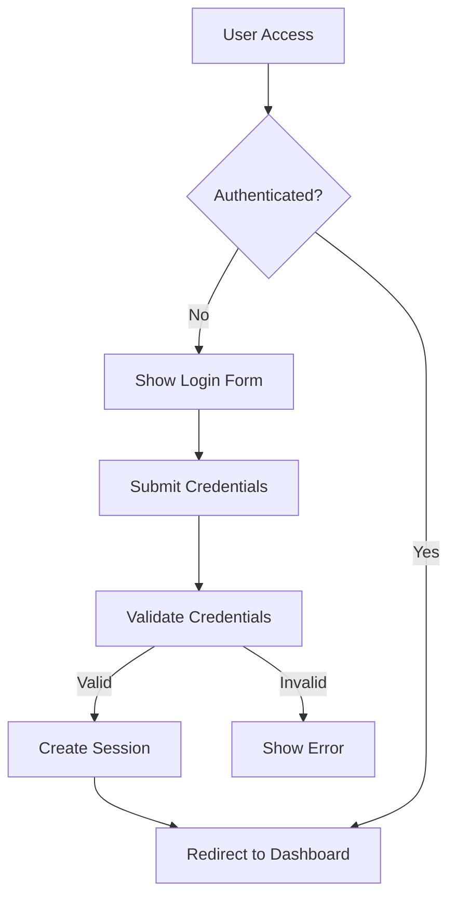
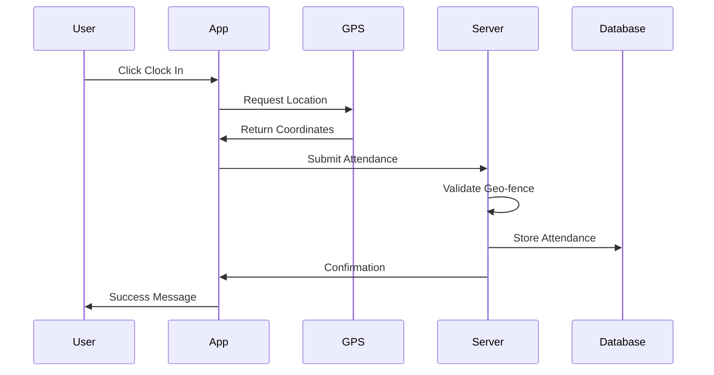
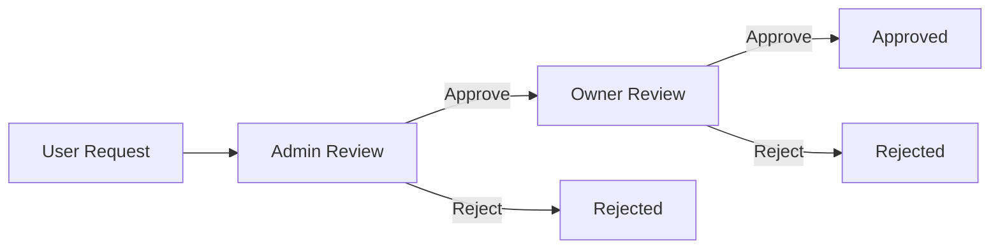

# 🔄 **ERGON - Complete System Workflow**

## 📋 **Table of Contents**
1. [System Architecture](#system-architecture)
2. [User Authentication Flow](#user-authentication-flow)
3. [Role-Based Workflows](#role-based-workflows)
4. [Core Module Workflows](#core-module-workflows)
5. [API Workflows](#api-workflows)
6. [Database Schema](#database-schema)
7. [Security Workflows](#security-workflows)
8. [Deployment Workflow](#deployment-workflow)

---

## 🏗️ **System Architecture**

### **MVC Structure**
```
ergon/
├── index.php                 # Main entry point
├── app/
│   ├── config/              # Configuration files
│   │   ├── constants.php    # System constants
│   │   ├── database.php     # DB configuration
│   │   ├── environment.php  # Environment detection
│   │   └── routes.php       # Route definitions
│   ├── core/               # Core framework
│   │   ├── Router.php      # Request routing
│   │   ├── Controller.php  # Base controller
│   │   └── Session.php     # Session management
│   ├── controllers/        # Business logic
│   ├── models/            # Data layer
│   ├── middlewares/       # Request middlewares
│   └── helpers/           # Utility classes
├── views/                 # Presentation layer
├── public/               # Web accessible files
└── storage/              # Logs and cache
```

### **Request Lifecycle**
1. **Entry Point**: `index.php` receives all requests
2. **Router**: Parses URL and matches routes
3. **Middleware**: Authentication and authorization
4. **Controller**: Handles business logic
5. **Model**: Database operations
6. **View**: Renders response

---

## 🔐 **User Authentication Flow**

### **Login Process**


### **Session Management**
- **Session Timeout**: 3600 seconds (1 hour)
- **Security**: HTTP-only cookies, strict mode
- **Validation**: IP-based session validation
- **Cleanup**: Automatic garbage collection

### **Password Security**
- **Hashing**: bcrypt with salt
- **Reset**: Email-based token system
- **Policy**: Minimum 8 characters, complexity rules

---

## 👥 **Role-Based Workflows**

### **Owner Workflow**
```
Owner Dashboard
├── System Analytics
├── User Management
│   ├── Create/Edit Users
│   ├── Role Assignment
│   └── Bulk Operations
├── Approval Management
│   ├── Leave Approvals
│   ├── Expense Approvals
│   └── Advance Approvals
├── Reports & Analytics
└── System Settings
```

### **Admin Workflow**
```
Admin Dashboard
├── Team Management
├── Task Assignment
│   ├── Create Tasks
│   ├── Assign to Users
│   └── Monitor Progress
├── Attendance Review
├── First-Level Approvals
└── Department Management
```

### **User Workflow**
```
User Dashboard
├── Daily Attendance
│   ├── Clock In/Out
│   └── GPS Validation
├── Task Management
│   ├── View Assigned Tasks
│   ├── Update Progress
│   └── Submit Completion
├── Request Submission
│   ├── Leave Requests
│   ├── Expense Claims
│   └── Advance Requests
└── Profile Management
```

---

## 🔧 **Core Module Workflows**

### **1. GPS Attendance System**

#### **Clock-In Process**


#### **Geo-fence Validation**
- **Office Location**: Stored in settings
- **Allowed Radius**: Configurable (default 100m)
- **Override**: Admin can approve out-of-range attendance
- **Logging**: All GPS coordinates logged for audit

### **2. Task Management System**

#### **Task Lifecycle**
```
Created → Assigned → In Progress → Review → Completed
    ↓         ↓           ↓          ↓         ↓
  Admin    User      User       Admin    Archive
```

#### **Task Types**
- **Checklist**: Simple completion tasks
- **Milestone**: Project-based with deadlines
- **Timed**: Duration-based tasks
- **Ad-hoc**: Immediate priority tasks

### **3. Leave Management System**

#### **Leave Request Flow**


#### **Leave Types**
- **Casual Leave**: Short-term personal leave
- **Sick Leave**: Medical leave with certificate
- **Annual Leave**: Vacation time
- **Emergency Leave**: Immediate approval needed

### **4. Expense Management System**

#### **Expense Claim Process**
1. **User Submission**: Upload receipts, categorize
2. **Admin Validation**: Verify receipts and amounts
3. **Owner Approval**: Final approval for payment
4. **Processing**: Mark as paid/processed

#### **Expense Categories**
- **Travel**: Transportation costs
- **Food**: Meal allowances
- **Material**: Work-related purchases
- **Communication**: Phone/internet bills

### **5. Daily Workflow System**

#### **Morning Planning**
- **Task Planning**: Users plan daily tasks
- **Priority Setting**: High/Medium/Low priorities
- **Time Estimation**: Expected completion time
- **Department Sync**: Align with team goals

#### **Evening Update**
- **Progress Review**: Update task completion
- **Blocker Reporting**: Identify obstacles
- **Next Day Planning**: Prepare for tomorrow
- **Analytics Update**: Performance metrics

---

## 🔌 **API Workflows**

### **Mobile App Integration**

#### **Authentication API**
```
POST /api/login
{
    "email": "user@example.com",
    "password": "password"
}

Response:
{
    "success": true,
    "token": "jwt_token",
    "user": {...}
}
```

#### **Attendance API**
```
POST /api/attendance
{
    "action": "clock_in",
    "latitude": 12.9716,
    "longitude": 77.5946,
    "timestamp": "2024-01-01T09:00:00Z"
}
```

#### **Task API**
```
GET /api/tasks
Authorization: Bearer jwt_token

Response:
{
    "tasks": [
        {
            "id": 1,
            "title": "Task Title",
            "status": "in_progress",
            "due_date": "2024-01-01"
        }
    ]
}
```

### **Offline Sync**
- **Local Storage**: Cache data when offline
- **Sync Queue**: Queue actions for later sync
- **Conflict Resolution**: Handle data conflicts
- **Background Sync**: Automatic sync when online

---

## 🗄️ **Database Schema**

### **Core Tables**
```sql
-- Users table
users (id, employee_id, name, email, password, role, department_id, status)

-- Attendance table
attendance (id, user_id, clock_in, clock_out, latitude, longitude, status)

-- Tasks table
tasks (id, title, description, assigned_to, created_by, status, priority, due_date)

-- Leaves table
leaves (id, user_id, type, start_date, end_date, reason, status, admin_approval, owner_approval)

-- Expenses table
expenses (id, user_id, amount, category, description, receipt_path, status)

-- Advances table
advances (id, user_id, amount, reason, status, admin_approval, owner_approval)
```

### **Relationships**
- **Users** → **Departments** (Many-to-One)
- **Users** → **Tasks** (One-to-Many)
- **Users** → **Attendance** (One-to-Many)
- **Users** → **Leaves/Expenses/Advances** (One-to-Many)

---

## 🛡️ **Security Workflows**

### **Input Validation**
```php
// Sanitize all inputs
$input = filter_input(INPUT_POST, 'field', FILTER_SANITIZE_STRING);

// Validate data types
if (!filter_var($email, FILTER_VALIDATE_EMAIL)) {
    throw new Exception('Invalid email');
}
```

### **SQL Injection Prevention**
```php
// Use prepared statements
$stmt = $pdo->prepare("SELECT * FROM users WHERE email = ?");
$stmt->execute([$email]);
```

### **CSRF Protection**
```php
// Generate token
$_SESSION['csrf_token'] = bin2hex(random_bytes(32));

// Validate token
if (!hash_equals($_SESSION['csrf_token'], $_POST['csrf_token'])) {
    throw new Exception('CSRF token mismatch');
}
```

### **Rate Limiting**
- **Login Attempts**: 5 attempts per 15 minutes
- **API Calls**: 100 requests per minute
- **File Uploads**: 10MB max size, specific file types

---

## 🚀 **Deployment Workflow**

### **Development Environment**
```bash
# Local setup
git clone repository
composer install
cp .env.example .env
php -S localhost:8000 -t public
```

### **Production Deployment**
```yaml
# GitHub Actions workflow
name: Deploy to Production
on:
  push:
    branches: [main]
jobs:
  deploy:
    runs-on: ubuntu-latest
    steps:
      - uses: actions/checkout@v2
      - name: Deploy to server
        run: |
          rsync -avz --delete ./ user@server:/public_html/ergon/
          ssh user@server "cd /public_html/ergon && php migrate.php"
```

### **Environment Configuration**
```php
// Production settings
define('DB_HOST', 'production_host');
define('DB_NAME', 'production_db');
define('ENVIRONMENT', 'production');
define('DEBUG_MODE', false);
```

---

## 📊 **Monitoring & Analytics**

### **Performance Metrics**
- **Response Time**: Average page load time
- **Database Queries**: Query execution time
- **User Activity**: Active users, session duration
- **Error Rates**: Application errors, failed requests

### **Business Metrics**
- **Attendance Rate**: Daily/monthly attendance
- **Task Completion**: Task completion rates
- **Leave Utilization**: Leave usage patterns
- **Expense Trends**: Monthly expense analysis

### **Audit Logging**
```php
// Log all critical actions
AuditLogger::log([
    'user_id' => $_SESSION['user_id'],
    'action' => 'login',
    'ip_address' => $_SERVER['REMOTE_ADDR'],
    'timestamp' => date('Y-m-d H:i:s')
]);
```

---

## 🔄 **Maintenance Workflows**

### **Daily Tasks**
- **Backup Database**: Automated daily backups
- **Log Rotation**: Archive old log files
- **Cache Cleanup**: Clear expired cache entries
- **Health Checks**: Monitor system status

### **Weekly Tasks**
- **Performance Review**: Analyze slow queries
- **Security Scan**: Check for vulnerabilities
- **User Activity**: Review user engagement
- **System Updates**: Apply security patches

### **Monthly Tasks**
- **Data Archival**: Archive old records
- **Capacity Planning**: Monitor resource usage
- **Feature Review**: Analyze feature usage
- **Backup Testing**: Verify backup integrity

---

## 🎯 **Customization Points**

### **Configuration Files**
- `app/config/constants.php` - System constants
- `app/config/database.php` - Database settings
- `app/config/routes.php` - URL routing
- `views/layouts/dashboard.php` - UI layout

### **Business Logic**
- `app/controllers/` - Modify workflows
- `app/models/` - Database operations
- `app/helpers/` - Utility functions
- `app/middlewares/` - Request processing

### **UI Customization**
- `views/` - HTML templates
- `assets/css/` - Styling
- `assets/js/` - JavaScript functionality

---

## 📝 **Next Steps for Customization**

1. **Review Current Implementation**: Examine existing controllers and models
2. **Identify Requirements**: Define specific business needs
3. **Modify Workflows**: Update controllers and routes as needed
4. **Test Changes**: Verify functionality in development
5. **Deploy Updates**: Push changes to production

This workflow provides a complete foundation that can be adapted to your specific requirements while maintaining the core architecture and security features.